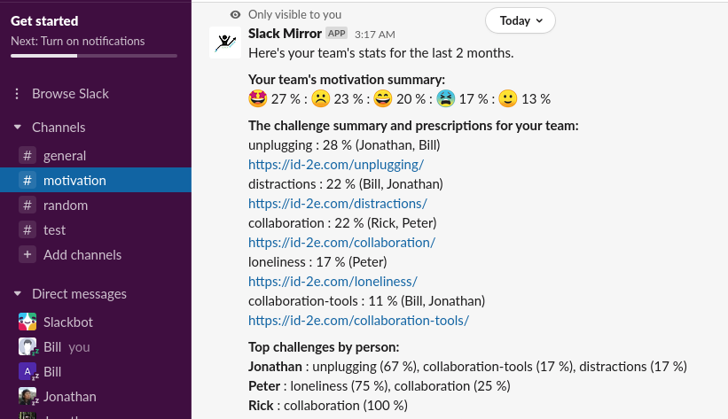
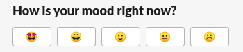
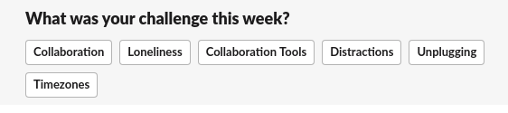

# Slack Mirror


---

## Prerequisites

- git
- Node.js v10 (you can use `nvm` to switch versions)
- yarn (`npm install -g yarn`)
- Your own Firebase Project ([you can create one here](https://console.firebase.google.com) - it has to be a paid plan to make external calls)
- Your own Slack space for testing
- a test Slack App ([you can create one here](https://api.slack.com/apps))

---

## How to Install

If you don't have `firebase` and `nvm`, you can install them globally.

```bash
yarn global add firebase-tools nvm
```

If this is first time using `firebase` from CLI, you need to login.

```bash
firebase login
```

Clone this repo and install node packages.

```bash
git clone https://github.com/SebastianKrieger/id-2e-brief2.git
cd id-2e-brief2
yarn
```

Initialize firebase, choose Firestore and Functions. During the initialization, don't overwrite any files.

```bash
cd firebase
firebase init
```

Install node packages for Cloud Functions, you need to use Node v10.

```bash
cd functions
nvm use 10
yarn
```

Set `Slack Signing Secret` from your test Slack app to a Function env variable.

You can get it from `Basic Information` tab of your app setting page.

```bash
firebase functions:config:set slack.secret="xxxxxxxxxxxxxxxxx"
```

Set `Bot User OAuth Access Token` from your test Slack app to a Function env variable.

You can get it from `OAuth & Permission` tab of your app setting page.

```bash
firebase functions:config:set slack.bot_token="xxxxxxxxxxxxxxxxx"
```

Deploy Functions.

```bash
firebase deploy --only functions
```

Enforce Firestore [rules](firebase/firestore.rules) & [indexes](firebase/firestore.indexes.json).

```bash
firebase deploy --only firstore
```

Create slash commands in your Slack app with at least the following settings.

- `Command` : the command below
- `Request URL` : Your cloud function endpoint for the command ([get it from Firebase console after function deployment](https://console.firebase.google.com/))

The rest is whatever.

Enable interactivity on your slack app with `/interact` function endpoint.

You can do it on `Interactivity & Shortcuts` tab of your app setting page.

Finally reinstall the Slack app to your Slack space.

---

## Slack Commands



---

### /slack-mirror
This is the main command which will show a menu of what the user can do.

```bash
/slack-mirror
```
---

### /add-supervisor
Add a supervisor. Supvervisors can view the team stats.

```bash
/add-supervisor @user_name
```
---

### /remove-supervisor
Remove a supervisor.

```bash
/remove-supervisor @user_name
```
---

### /record-mood [*DD.MM.YYYY]
Record your mood at arbitrary time. The date is optional. If not specified, the timestamp will be now.

(*note*) This command is needed for test purposes so we can record moods with any date.

```bash
/record-mood 01.01.2020
```


---

### /record-challenge [*DD.MM.YYYY]
Record your challenge at arbitrary time. The date is optional. If not specified, the timestamp will be now.

(*note*) This command is needed for test purposes so we can record challenges with any date.

```bash
/record-challenge 01.01.2020
```


---

## Dashboard

You can run a local instance of the dashboard app on your computer to view your team stats.


The app is developed with [Next.js](https://nextjs.org/) / [Next Dapp](https://warashibe.github.io/next-dapp/) frameworks.

To use the dashbard feature, move the file `nd/conf.sample.js` to `nd/conf.js` and replace the `fb` field with yoru firebase settings. This is a feature from `Next Dapp`  described [here](https://warashibe.github.io/next-dapp/docs/plugin-fb).

```js
...
  fb: {
    name: "xxx",
    id: "xxxxxx",
    key: "xxxxxxxxxx",
    sender: "12345678",
    region: "us-central1"
  }
...
```

Then just run the following command in the app root folder. This will start the `Next.js` app.

```bash
yarn dev
```

Now you can access your local app at [https://localhost:3000](https://localhost:3000).

## Data Structures

Data are stored in Firestore with the collections below.

### users

```json
{
  date: 1602997350453,
  last_challenge: 1602997357062,
  last_mood: 1603000006575,
  track: true,
  user_id: "XXXXXXX",
  user_name: "John"
}
```

### moods

```json
{
  date: 1602997350453,
  user_id: "XXXXXXX",
  value: 5
}
```

### challenges

```json
{
  date: 1602997350453,
  user_id: "XXXXXXX",
  value: "a",
  text: "Socializing"
}
```

---
## How to Contribute to development

1. fork this repo
2. clone your forked repo
3. make changes
4. lint
5. commit
6. push
7. make a PR

I set up a code formatting command using [prettier@2.0.5](https://prettier.io/), if you lint before commiting, our commit history will be clean. You can simply run this command in the root directory before `git commit`.

```bash
yarn lint
```

FYI, the prettier settings are defined in `package.json` as below.

```json
  "prettier": {
    "semi": false,
    "arrowParens": "avoid"
  }
```

---

## How to Add a new function for a Slack slash command

All you have to do is to define a `cloud function` in the file located at [firebase/functions/index.js](firebase/functions/index.js) and set up a `slash command` accordingly in your Slack app.

A sample function is the following.
1. Make sure its a `POST` method with `verifyMethod(req, "POST")`
2. Verify the request is from Slack with `verifyWebhook(req)`
3. Do your thing

```javascript
exports.genie = functions.https.onRequest(async (req, res) => {
  try {
    verifyMethod(req, "POST")
    verifyWebhook(req)

    await db.collection("wishes").add({ ...req.body, date: Date.now() })
    res.send(
      `Your Wish: ${req.body.text}\nGenie: ...seems to be sleeping at the moment, sorry!`
    )

    return Promise.resolve()
  } catch (err) {
    console.error(err)
    res.status(err.code || 500).send(err)
    return Promise.reject(err)
  }
})
```

So the part you want to change for your function is the following.

```javascript
// saving the wish to Firesotre as is for the genie command
await db.collection("wishes").add({ ...req.body, date: Date.now() })
res.send(
  `Your Wish: ${req.body.text}\nGenie: ...seems to be sleeping at the moment, sorry!`
)
```

And the rest is just formality.

That's it!

## LICENSE

Slack Mirror is published under [MIT](LICENSE) license.

Copyright (c) 2020 ID-2E Research team at [CODE University of Applied Sciences](https://code.berlin) in Berlin, Germany
